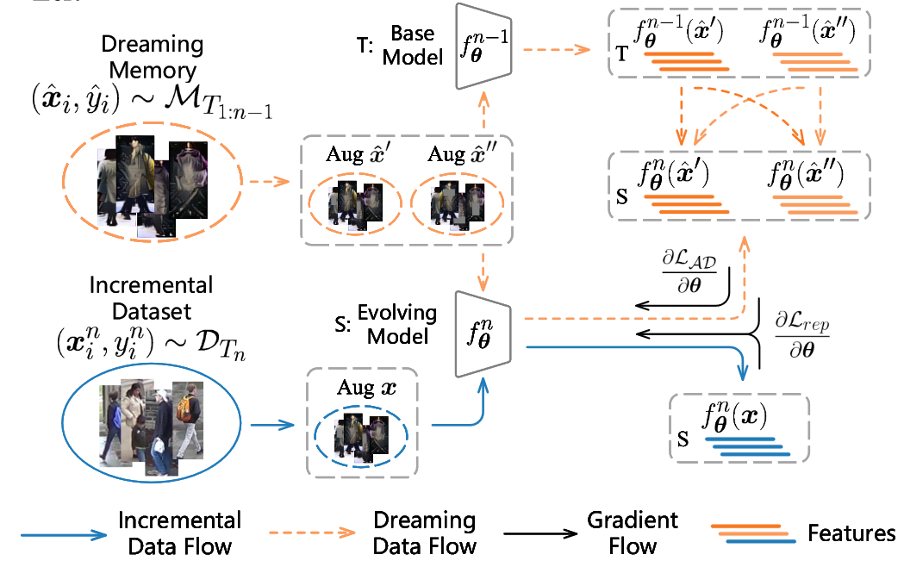

# 论文名称

## 目录

- [1. 简介]()
- [2. 数据集和复现精度]()
- [3. 准备数据与环境]()
    - [3.1 准备环境]()
    - [3.2 准备数据]()
    - [3.3 准备模型]()
- [4. 开始使用]()
    - [4.1 模型训练]()
    - [4.2 模型评估]()
    - [4.3 模型预测]()
- [5. 模型推理部署]()
    - [5.1 基于Inference的推理]()
    - [5.2 基于Serving的服务化部署]()
- [6. 自动化测试脚本]()
- [7. LICENSE]()
- [8. 参考链接与文献]()


## 1. 简介

论文构建了一个无数据增量记忆ReID框架用于解决隐私问题;
提出了增强蒸馏(AD)，其中蒸馏以成对和交叉模式进行，以解决“噪声蒸馏”现象；提出了几何蒸馏(GD)，通过漂移时几何地保持空间结构来适应新的和先前的知识；论文提出的AGD优于基线，提升为6.0% mAP / 7.9% R@1。

<div align="center">

<p>AGD整体流程图</p>
</div>

**论文:** [Augmented Geometric Distillation for Data-Free Incremental Person ReID](https://openaccess.thecvf.com/content/CVPR2022/html/Lu_Augmented_Geometric_Distillation_for_Data-Free_Incremental_Person_ReID_CVPR_2022_paper.html)


在此非常感谢`$eddiely$`等人贡献的[Augmented-Geometric-Distillation](https://github.com/eddielyc/Augmented-Geometric-Distillation)，`$JDAI-CV$`贡献的[fast-reid](https://github.com/JDAI-CV/fast-reid)提高了本repo复现论文的效率。


## 2. 数据集和复现精度

### 2.1 数据集
数据集为MSMT17和Market1501，数据集可以在以下链接下载。
* Market1501：[baidu pan](https://pan.baidu.com/s/1ntIi2Op) or [google driver](https://drive.google.com/file/d/0B8-rUzbwVRk0c054eEozWG9COHM/view)
* MSMT17：[baidu pan](https://pan.baidu.com/s/19-cKxL_UVKNHc7kqqp0GVg)  提取码：yf3z


### 2.2 复现精度
| 任务  | 数据集| 论文mAP|复现mAP|论文R@1 | 复现R@1  |  
| :--- | :--- |  :----:  | :--------: |  :----  |   :----  | 
|任务一|msmt17| 46.5%|   46.2%|72.1% |70.8%  |

| 任务  | 数据集    | 论文mAP | 复现mAP | 论文R@1 | 复现R@1 |
|:----|:-------|:-----:|:-----:|:------|:------| 
| 任务二 | msmt17 | 41.9% | 40.6% | 67.5% | 66.4% |
| 任务二 | market | 80.5% | 80.3% | 91.9%  | 91.3% |


## 3. 准备数据与环境


### 3.1 准备环境

* 安装环境

```bash
conda create -n ppcls python=3.7
pip install -r requirements.txt
```

* 下载代码

```bash
git clone https://github.com/Cloud-Rambler/Augmented-Geometric-Distillation-PaddlePaddle.git
cd Augmented-Geometric-Distillation-PaddlePaddle
```

### 3.2 准备数据

将数据集解压到`./data`目录下，数据集目录结构如下：

Datasets Structure
```
./data
- market
  - bounding_box_test
  - bounding_box_train
  - query
 
- msmt17
  - bounding_box_test
  - bounding_box_train
  - query

...
```

### 3.3 准备模型


前往[这里](https://paddle-imagenet-models-name.bj.bcebos.com/dygraph/others/resnet50-19c8e357_torch2paddle.pdparams)下载预训练模型并放入`./checkpoints`目录下。


## 4. 开始使用


### 4.1 模型训练

* 训练任务$T_1$ (MSMT17):
```
python ./tools/main.py -g 0 --dataset msmt17 --logs-dir ./logs/msmt17
```

* 通过DeepInversion[1]生成dreaming data:
```
python ./tools/inversion.py -g 0 --generation-dir ./data/generations_r50_msmt17 --shots 40 --iters 640 --teacher ./logs/msmt17
```

* 使用 Geometric Distillation loss在任务$T_2$上训练 incremental model
```
python ./tools/main_incremental.py --dataset market --previous ./logs/msmt17 --logs-dir ./logs/msmt17-market_GD --inversion-dir ./data/generations_r50_msmt17 -g 0 --evaluate 80 --seed 1 --algo-config ./ppcls/configs/res-triangle.yaml
```

* 使用 simple Geometric Distillation loss (detailed in Supp. and usually report better performance)在任务$T_2$上训练 incremental model:
```
python ./tools/main_incremental.py --dataset market --previous ./logs/msmt17 --logs-dir ./logs/msmt17-market_simGD --inversion-dir ./data/generations_r50_msmt17 -g 0 --evaluate 80 --seed 1 --algo-config ./ppcls/configs/sim-res-triangle.yaml
```

* 使用Augmented Distillation在任务$T_2$上训练 incremental model:
```
python .tools/main_incrementalX.py --dataset market --previous ./logs/msmt17 --logs-dir ./logs/msmt17-market_XsimGD --inversion-dir ./data/generations_r50_msmt17 -g 0 --evaluate 80 --seed 1 --peers 2 --epoch 80 --algo-config ./ppcls/configs/inverXion.yaml
```

### 4.2 模型评估

```angular2svg
python ./tools/evaluate.py --dataset msmt17 market --ckpt ./logs/msmt17-market_XsimGD/checkpoint.pdparams --output 
```

## 5. TIPC


* 准备数据

```bash
# 解压数据，如果您已经解压过，则无需再次运行该步骤
cd data
tar -xf lite_data.tar
```

* 运行测试命令

```bash
bash test_tipc/test_train_inference_python.sh test_tipc/configs/AGD/train_infer_python.txt lite_train_lite_infer
```

如果运行成功，在终端中会显示下面的内容，具体的日志也会输出到`test_tipc/output/`文件夹中的文件中。

```
Run successfully with command - python ./tools/main_incrementalX.py --dataset market --previous ./logs/msmt17 --logs-dir ./logs/msmt17-market_XsimGD --inversion-dir ./data/generations_r50_msmt17 -g 0 --evaluate 80 --seed 1 --peers 2 --algo-config ./ppcls/configs/inverXion.yaml   !  
 ...
Run successfully with command - python ./tools/evaluate.py --dataset msmt17 market --ckpt ./logs/msmt17-market_XsimGD/checkpoint.pdparams --output  !
```


## 6. LICENSE

本项目的发布受[Apache 2.0 license](./LICENSE)许可认证。

## 7. 参考链接与文献
[1] Yin, Hongxu, et al. "Dreaming to distill: Data-free knowledge transfer via deepinversion." Proceedings of the IEEE/CVF Conference on Computer Vision and Pattern Recognition. 2020.

[2] FastReID: A Pytorch Toolbox for General Instance Re-identification, He, Lingxiao and Liao, Xingyu and Liu, Wu and Liu, Xinchen and Cheng, Peng and Mei, Tao, arXiv preprint arXiv:2006.02631, 2020
