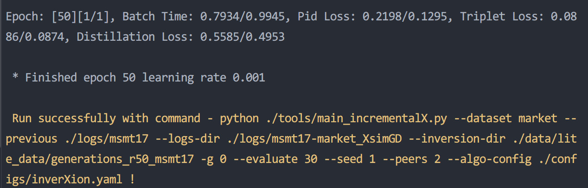
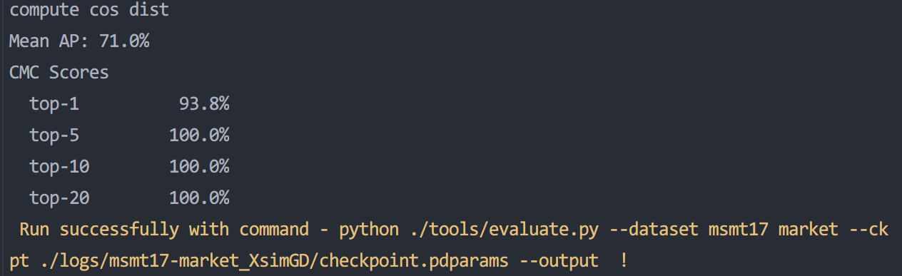

# 飞桨训推一体认证（TIPC）

## 1. 简介

飞桨除了基本的模型训练和预测，还提供了支持多端多平台的高性能推理部署工具。本文档提供了`$repo名称$`中所有模型的飞桨训推一体认证 (Training and Inference Pipeline Certification(TIPC)) 信息和测试工具，方便用户查阅每种模型的训练推理部署打通情况，并可以进行一键测试。

<div align="center">
    
</div>

## 2. 汇总信息

打通情况汇总如下，已填写的部分表示可以使用本工具进行一键测试，未填写的表示正在支持中。

**字段说明：**
- 基础训练预测：包括模型训练、Paddle Inference Python预测。
- 更多训练方式：包括多机多卡、混合精度。
- 模型压缩：包括裁剪、离线/在线量化、蒸馏。
- 其他预测部署：包括Paddle Inference C++预测、Paddle Serving部署、Paddle-Lite部署等。

更详细的mkldnn、Tensorrt等预测加速相关功能的支持情况可以查看各测试工具的[更多教程](#more)。

## 3. 测试流程

### 3.1 目录

```
test_tipc/
├── configs/    # 配置文件目录
    ├── AGD  # DCLNet模型的测试配置文件目录 
        ├── train_infer_python.txt      # 基础训练推理测试配置文件
├──docs         # 文档目录
    ├── test_train_inference_python.md  # 基础训练推理测试说明文档
├── test_train_inference_python.sh      # TIPC基础训练推理测试解析脚本
├── common_func.sh                      # TIPC基础训练推理测试常用函数
└── readme.md                           # 使用文档
```

### 3.2 执行测试


* 准备数据

```bash
# 解压数据，如果您已经解压过，则无需再次运行该步骤
cd data
tar -xf lite_data.tar
```

测试单项功能仅需执行以下命令，**如需测试不同模型/功能，替换配置文件即可**：
```bash
bash test_tipc/test_train_inference_python.sh test_tipc/configs/AGD/train_infer_python.txt lite_train_lite_infer
```

如果运行成功，在终端中会显示下面的内容，具体的日志也会输出到`test_tipc/output/`文件夹中的文件中。

```
Run successfully with command - python ./tools/main_incrementalX.py --dataset market --previous ./logs/msmt17 --logs-dir ./logs/msmt17-market_XsimGD --inversion-dir ./data/generations_r50_msmt17 -g 0 --evaluate 80 --seed 1 --peers 2 --algo-config ./ppcls/configs/inverXion.yaml   !  
 ...
Run successfully with command - python ./tools/evaluate.py --dataset msmt17 market --ckpt ./logs/msmt17-market_XsimGD/checkpoint.pdparams --output  !
```
<div align="center">


<p>TIPC执行结果</p>
</div>

关于本示例命令的更多信息可查看[基础训练预测使用文档](#more)。

### 3.3 配置文件命名规范

在`configs`目录下，**按模型名称划分为子目录**，子目录中存放所有该模型测试需要用到的配置文件，配置文件的命名遵循如下规范：

1. 基础训练预测配置简单命名为：`train_infer_python.txt`，表示**Linux环境下单机、不使用混合精度训练+python预测**，其完整命名对应`train_linux_gpu_normal_normal_infer_python_linux_gpu_cpu.txt`，由于本配置文件使用频率较高，这里进行了名称简化。

2. 其他带训练配置命名格式为：`train_训练硬件环境(linux_gpu/linux_dcu/…)_是否多机(fleet/normal)_是否混合精度(amp/normal)_预测模式(infer/lite/serving/js)_语言(cpp/python/java)_预测硬件环境(linux_gpu/mac/jetson/opencl_arm_gpu/...).txt`。如，linux gpu下多机多卡+混合精度链条测试对应配置 `train_linux_gpu_fleet_amp_infer_python_linux_gpu_cpu.txt`，linux dcu下基础训练预测对应配置 `train_linux_dcu_normal_normal_infer_python_linux_dcu.txt`。

3. 仅预测的配置（如serving、lite等）命名格式：`model_训练硬件环境(linux_gpu/linux_dcu/…)_是否多机(fleet/normal)_是否混合精度(amp/normal)_(infer/lite/serving/js)_语言(cpp/python/java)_预测硬件环境(linux_gpu/mac/jetson/opencl_arm_gpu/...).txt`，即，与2相比，仅第一个字段从train换为model，测试时模型直接下载获取，这里的“训练硬件环境”表示所测试的模型是在哪种环境下训练得到的。

**根据上述命名规范，可以直接从子目录名称和配置文件名找到需要测试的场景和功能对应的配置文件。**


<a name="more"></a>
